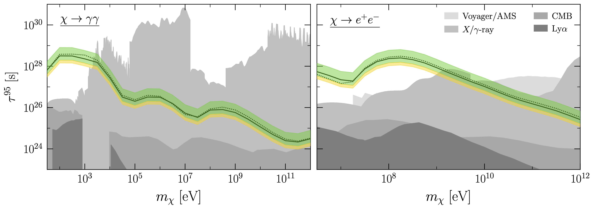

# DM21cm - Inhomogeneous Energy Injection in 21cm Cosmology

[](https://arxiv.org/abs/2312.11608)

<p align="center"></p>

## HERA sensitivity to dark matter monochromatic decays in 21-cm power spectrum


## Usage

```python
from dm21cm.injections.decay import DMDecayInjection
from dm21cm.evolve import evolve

import py21cmfast as p21c

return_dict = evolve(
    run_name = 'test_injection',
    z_start = 45.,
    z_end = 5.,
    injection = DMDecayInjection(
        primary='phot_delta',
        m_DM=1e8, # [eV]
        lifetime=1e28, # [s]
    ),
    p21c_initial_conditions = p21c.initial_conditions(
        user_params = p21c.UserParams(
            HII_DIM = 64,
            BOX_LEN = 256, # [conformal Mpc]
        ),
    ),
    p21c_astro_params = p21c.AstroParams(),
)
```

## Installation

### Prerequisite: DarkHistory
- Clone the DarkHistory repository [here](https://github.com/hongwanliu/DarkHistory/tree/DM21cm). Checkout branch `master`.
- Install following DarkHistory's `README.md`.

### Prerequisite: 21cmFAST
- Clone the 21cmFAST fork [here](https://github.com/joshwfoster/21cmFAST). Checkout branch `master`.
- Install 21cmFAST according to README.md
  - Install gcc and have environment variable `CC` point to the binary.
  - Install gsl (GNU Scientific Library) and have `GSL_LIB` point to the directory of the library.
  - Install fftw and have `FFTW_INC` point to the directory containing fftw header files.
  - Install `21cmFAST` via `pip install .` in the project directory.
- Set environment variable `P21C_CACHE_DIR` to a directory for storing cached files (requries at least 10G for a 128^3 box 1.01 redshift step run).

### DM21cm
- Clone this repository. Checkout branch `main`.
- Download data files from [here](https://doi.org/10.5281/zenodo.10397814).
- Install the require packages via `pip install -r requirements.txt`. We recommend installing `JAX` according to your hardware (e.g. GPU) specification.
- Set environment variable `DM21CM_DIR` to point to the project folder (directory containing `README.md`).
- Set environment variable `DM21CM_DATA_DIR` to point to the data folder (directory containing `abscissas.h5`).

## Defining your custom injection

```python
import dm21cm.physics as phys
from dm21cm.injections.base import Injection
from darkhistory.spec import pppc
import numpy as np

class CustomInjection (Injection):

    def __init__(self):
        self.mode = 'Decay implemented again'
        self.primary = primary
        self.m_DM = m_DM
        self.lifetime = lifetime

    #===== injections =====
    def inj_rate(self, z):
        """Injection event rate density in [injection / pcm^3 s]. [pcm] = [physical cm].
        Used in DarkHistory part of the evolution.
        """
        rho_DM = phys.rho_DM * (1+z)**3 # [eV / pcm^3]
        return float((rho_DM/self.m_DM) / self.lifetime) # [inj / pcm^3 s]
    
    def inj_power(self, z):
        """Injection power density in [eV / pcm^3 s].
        Used in DarkHistory.
        """
        return self.inj_rate(z) * self.m_DM # [eV / pcm^3 s]
    
    def inj_phot_spec(self, z, **kwargs):
        """Injected photon rate density spectrum assuming a homogeneous universe in [# / pcm^3 s].
        Used in DarkHistory.
        """
        return self.phot_spec_per_inj * self.inj_rate(z) # [phot / pcm^3 s]
    
    def inj_elec_spec(self, z, **kwargs):
        """Injected electron rate density spectrum assuming a homogeneous universe in [# / pcm^3 s].
        Used in DarkHistory.
        """
        return self.elec_spec_per_inj * self.inj_rate(z) # [elec / pcm^3 s]
    
    def inj_phot_spec_box(self, z, delta_plus_one_box=..., **kwargs):
        """Injected photon rate density spectrum [# / pcm^3 s] and weight box [dimensionless]."""
        return self.inj_phot_spec(z), delta_plus_one_box # [phot / pcm^3 s], [1]

    def inj_elec_spec_box(self, z, delta_plus_one_box=..., **kwargs):
        """Injected electron rate density spectrum [# / pcm^3 s] and weight box [dimensionless]."""
        return self.inj_elec_spec(z), delta_plus_one_box # [elec / pcm^3 s], [1]

    #===== utilities =====
    def set_binning(self, abscs):
        """Inherent binning from `evolve` function."""
        self.phot_spec_per_inj = pppc.get_pppc_spec(
            self.m_DM, abscs['photE'], self.primary, 'phot', decay=True
        ) # [# / injection event]
        self.elec_spec_per_inj = pppc.get_pppc_spec(
            self.m_DM, abscs['elecEk'], self.primary, 'elec', decay=True
        ) # [# / injection event]

    def is_injecting_elec(self):
        """Optionally turn off electron injection."""
        return not np.allclose(self.elec_spec_per_inj.N, 0.)
    
    def get_config(self):
        """For caching darkhistory runs."""
        return {
            'mode': self.mode,
            'primary': self.primary,
            'm_DM': self.m_DM,
            'lifetime': self.lifetime
        }
```

## Authors
Yitian Sun, Joshua W. Foster, Hongwan Liu, Julian B. Muñoz, and Tracy R. Slatyer
