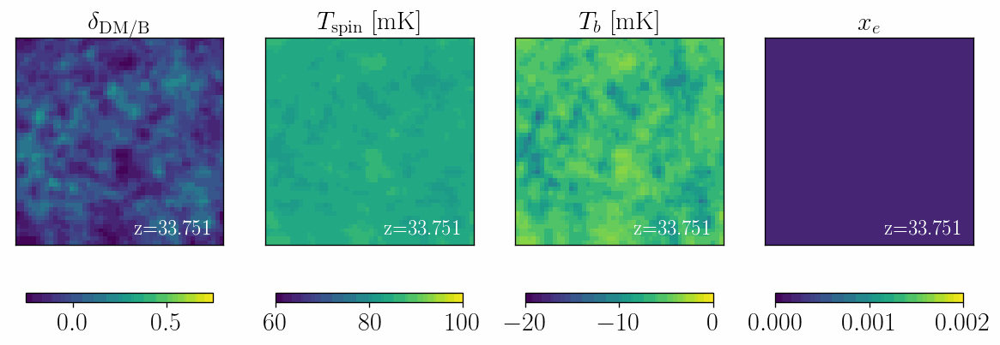

# DM21cm

<!---  --->

## Assumptions
 - Using Planck18 dt everywhere (consistent with 21cmFAST)

## Debug deconstructor
 - [ ] Remove `xraycheck`
 - [ ] Restore commented out code near line 1960 in SpinTemperatureBox.c
 - [ ] Check bath is turned on.
 - [ ] In `dh_wrappers`, address all warnings.
 - [X] Make consistent `dt`
 - [X] Change zf01-generated DarkHistory tf's nBs back to 1. (from 1.006)
 - [ ] Restore YHe values

## Transfer functions status
 - zf01:  1 2 3A 3B 3C 3D 4
 - zf001: